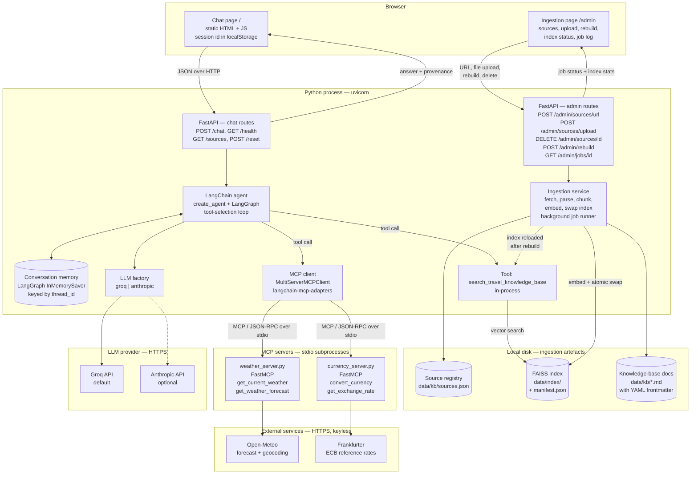
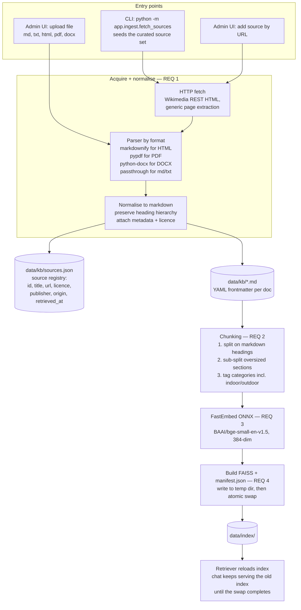
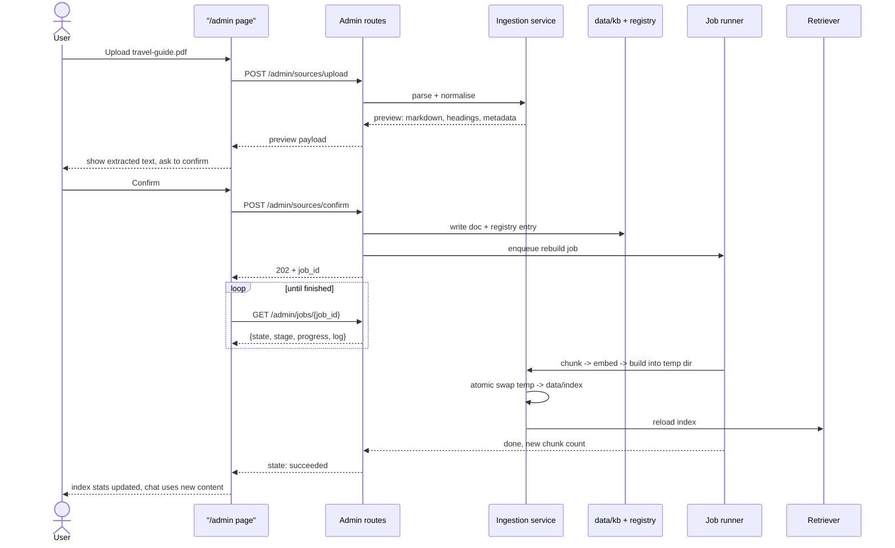
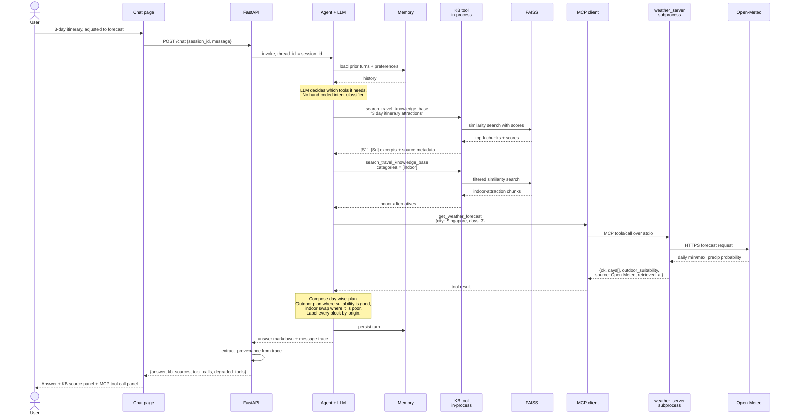
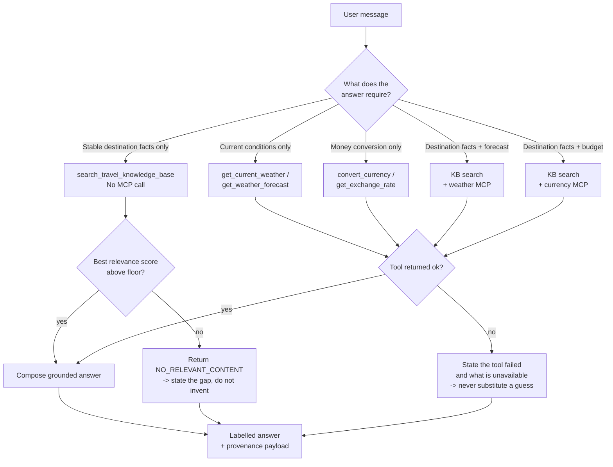
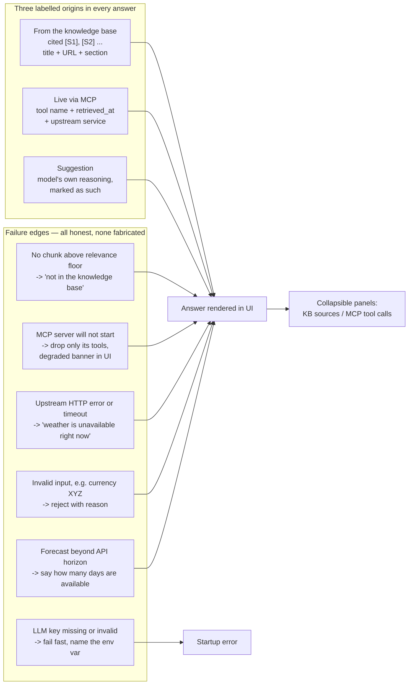

# Architecture — AI Travel Planning Assistant (Singapore)

> Design document, written before implementation. Diagrams are Mermaid and render directly on GitHub.
> Status: **T0 — design only. No code exists yet.**

## 1. What this system is

A chat assistant that plans trips to **Singapore** by combining two kinds of information that have very
different shelf lives:

| Kind | Example | Where it comes from | Freshness |
|---|---|---|---|
| **Destination knowledge** — stable | attractions, neighbourhoods, MRT, food, sample itineraries | RAG over a pre-built vector index of public travel documents | months |
| **Current information** — volatile | weather forecast, currency exchange rate | MCP tools calling live external services at query time | minutes / hours |

The single design rule that everything else follows from:

> **Every claim in an answer must be attributable to exactly one of three origins — the knowledge base
> (with source title + URL), an MCP tool (with tool name + retrieval timestamp), or the model's own
> suggestion (labelled as such).** Nothing is asserted without an origin.

---

## 2. System context



**Process boundaries, explicitly:**

- The **KB tool is in-process** — a vector search, not a network call. That is the point of RAG: stable
  knowledge is answered locally and cheaply.
- The **two MCP servers are separate OS processes**, spawned by the app and spoken to over stdio using
  the MCP protocol. They are the only components allowed to reach the live weather and currency
  services. If a server dies, the app keeps working with the tools that remain.
- The **LLM is remote** and pluggable. It never supplies destination facts or live data — it selects
  tools, composes prose, and makes clearly-labelled suggestions.
- The **ingestion page is a second page in the same app**, not a separate service. It shares config and
  the index with the chat side, so one `uvicorn` command runs everything. Ingestion work happens on a
  background job so the chat page stays responsive while an index rebuild runs.

---

## 3. Ingestion pipeline (offline, build-time)

Ingestion is **offline relative to a chat request** — no chat turn ever fetches or embeds a document.
But it is **interactive**: it has a UI, and it can be re-run at any time without restarting the app.

Three entry points feed the same pipeline:



**Curated seed sources** (the CLI path — ≥3 required, this gives 7 documents across 4 publishers):

| Source | Licence | Shipped how |
|---|---|---|
| Wikivoyage: Singapore + 5 district pages | CC BY-SA 4.0 | committed snapshot |
| Wikipedia: Mass Rapid Transit (Singapore) | CC BY-SA 4.0 | committed snapshot |
| Wikipedia: Singaporean cuisine | CC BY-SA 4.0 | committed snapshot |
| Visit Singapore: essential info / itineraries / things to do | restrictive | fetched at setup, gitignored |

Anything a user adds later through the admin UI is recorded in the same registry with
`origin: "url"` or `origin: "upload"`, so a citation from an uploaded PDF looks exactly like a citation
from Wikivoyage.

**Licensing is handled in the pipeline, not ignored.** Wikimedia sources are CC BY-SA and their
snapshots are **committed** to the repo. Visit Singapore's terms are restrictive, so those documents are
**fetched at setup time and gitignored** — the repo ships the instructions, not the content. The four
Wikimedia documents on their own already exceed the three-source minimum, so a Visit Singapore fetch
failure is a warning, never a build failure.

**Why chunk on headings first.** Travel guides are strongly sectioned ("See", "Eat", "Get around",
"Itineraries"). Splitting blindly at N characters severs an attraction from its opening hours and its
district. Splitting on headings keeps a retrieved chunk self-contained and gives us a free
`section_path` like `Singapore > Get around > MRT` for citations.

**Why tag categories at ingest.** Each chunk gets a `categories` list drawn from the brief's required
facets — `attractions`, `neighbourhoods`, `transport`, `culture`, `food`, `itinerary`, plus
**`indoor` / `outdoor`**. The indoor/outdoor tag is load-bearing, not decorative: it is what lets the
agent retrieve indoor alternatives for a rainy day in §5's flagship scenario.

---

### 3.1 Ingestion UI and job lifecycle

The `/admin` page makes the RAG pipeline inspectable instead of hiding it behind scripts. Layout:

```
┌─ Knowledge base ──────────────────────────────────────────────────────────┐
│ Index: built 2026-09-16 09:04 · bge-small-en-v1.5 · 384-dim · 812 chunks  │
│ Status: ready                                        [ Rebuild index ]    │
├───────────────────────────────────────────────────────────────────────────┤
│ Sources                                                                   │
│ ─────────────────────────────────────────────────────────────────────────  │
│ Wikivoyage: Singapore        CC BY-SA 4.0  url     214 chunks   [preview] │
│ Wikipedia: Singapore MRT     CC BY-SA 4.0  url      96 chunks   [ remove ]│
│ my-hotel-booking.pdf         user-supplied upload   11 chunks   [ remove ]│
├───────────────────────────────────────────────────────────────────────────┤
│ Add by URL  [ https://…                              ]  [ Fetch preview ] │
│ Upload      [ drop md / txt / html / pdf / docx here ]                    │
├───────────────────────────────────────────────────────────────────────────┤
│ Job log   ▸ rebuild #7  running  chunking 412/812 …                       │
└───────────────────────────────────────────────────────────────────────────┘
```

A URL or upload is **previewed before it is committed** — the extracted markdown, detected headings, and
proposed metadata are shown first. A PDF that extracts as gibberish is visible immediately rather than
silently poisoning the index.



**Safety rules baked into the design:**

- **Chat never breaks mid-rebuild.** The new index is built in a temp directory and swapped in atomically;
  the retriever keeps serving the previous index until the swap lands. A failed rebuild leaves the working
  index untouched.
- **One rebuild at a time.** A second rebuild request returns the in-flight `job_id` rather than racing.
- **Registry is the source of truth**, not the directory listing — so a removal deletes the document, its
  registry entry and its chunks together, and a partially-deleted state is detectable.
- **Licence is a required field** on every added source, defaulting to `user-supplied` for uploads. That
  keeps citations honest for content the repo does not own.
- **Uploads are validated** on extension, size and extracted-text length; an empty extraction is rejected
  with the reason rather than accepted as an empty document.

## 4. Query-time flow — the flagship combined scenario

> *"Create a three-day Singapore itinerary for next week and adjust it according to the weather forecast."*

This one request exercises RAG requirements 5–7 and MCP requirements 10–13 together.



Note the two separate KB searches. The agent retrieves the general itinerary material *and* — once it
sees a poor-weather day in the forecast — goes back for indoor options. The weather result shapes what
gets retrieved, which is the substance of "combining both sources" rather than stapling them together.

---

## 5. Tool selection

Tool choice is made by the LLM from the tool descriptions and the system prompt. We do **not** write a
keyword-matching intent router; the brief asks for appropriate tool selection based on user intent, and
the agent loop is the mechanism for it. The prompt constrains it with hard rules.



**Examples of the routing, from the brief:**

| User asks | Tools fired | Why |
|---|---|---|
| "Must-visit attractions in Singapore?" | KB only | Stable knowledge. Calling an MCP tool here is explicitly wrong. |
| "How do tourists get around Singapore?" | KB only | Transport guidance is in the index. |
| "What's the weather in Singapore?" | weather MCP only | Time-sensitive; not knowable from documents. |
| "Convert INR 50,000 to SGD." | currency MCP only | Live rate. |
| "3-day itinerary, adjusted to the forecast" | KB + weather MCP | The combined scenario. |
| "Budget INR 60,000 — convert it and suggest a 3-day plan" | KB + currency MCP | Combined, money flavour. |
| "Best ski resorts in Singapore?" | KB attempted, floor not met | Answer states the knowledge base does not cover it. |

---

## 6. Provenance and honest degradation



Degradation is a **first-class design requirement**, not error handling bolted on afterwards. An
assistant that invents a forecast when Open-Meteo is unreachable is worse than one that says it cannot
reach the weather service. Every MCP tool therefore returns a uniform success/failure envelope rather
than raising, so the model always receives a fact it can report truthfully.

---

## 7. Components and responsibilities

| Component | File | Responsibility | Does **not** |
|---|---|---|---|
| Config | `app/config.py` | Typed settings from `.env` | contain secrets |
| Source registry | `app/ingest/registry.py` | Read/write `sources.json`, single source of truth for KB contents | fetch or parse |
| Source fetcher | `app/ingest/fetch_sources.py` | Acquire curated KB docs + record metadata/licence | chunk or embed |
| Document parsers | `app/ingest/parsers.py` | md / txt / html / pdf / docx → markdown + headings | decide what to keep |
| Chunker | `app/ingest/chunk.py` | Heading-aware split, category tagging | embed |
| Index builder | `app/ingest/build_index.py` | Embed + persist FAISS + manifest, atomic swap | serve queries |
| Ingestion service | `app/ingest/service.py` | add-by-URL, upload+preview, confirm, remove, rebuild; job state | expose HTTP |
| Retriever | `app/rag/retriever.py` | Vector search, score floor, filters, index reload | talk to the LLM |
| KB tool | `app/rag/kb_tool.py` | Expose retrieval as a LangChain tool with citation markers | fetch live data |
| Weather MCP server | `app/mcp_servers/weather_server.py` | MCP tools over Open-Meteo | know about RAG or the LLM |
| Currency MCP server | `app/mcp_servers/currency_server.py` | MCP tools over Frankfurter | know about RAG or the LLM |
| MCP client | `app/mcp_client.py` | Spawn servers, discover tools, degrade per-server | implement tool logic |
| LLM factory | `app/llm.py` | Provider selection + fail-fast key check | hold prompts |
| Prompts | `app/prompts.py` | Grounding, provenance and preference contract | call anything |
| Agent | `app/agent.py` | Tool loop, memory, provenance extraction | do HTTP itself |
| Chat API | `app/api.py` | Chat HTTP surface, lifespan, error shaping | contain AI logic |
| Admin API | `app/admin_api.py` | Ingestion HTTP surface, job polling | implement ingestion logic |
| Chat UI | `app/static/index.html` | Render answer + provenance panels | contain AI logic |
| Admin UI | `app/static/admin.html` | Source management, preview, rebuild, job log | implement ingestion logic |

The MCP servers deliberately know nothing about the rest of the app. They are standalone MCP servers that
could be pointed at any MCP client, which is what makes this a real MCP integration rather than a
function call wearing an MCP label.

---

## 8. Data contracts

**Chunk metadata** — carried from ingest through retrieval into the citation:

```json
{
  "source_id": "wikivoyage-singapore",
  "source_title": "Wikivoyage: Singapore",
  "source_url": "https://en.wikivoyage.org/wiki/Singapore",
  "license": "CC BY-SA 4.0",
  "publisher": "Wikivoyage",
  "retrieved_at": "2026-09-16T00:00:00Z",
  "section_path": "Singapore > Get around > MRT",
  "chunk_id": "wikivoyage-singapore#0042",
  "categories": ["transport", "indoor"]
}
```

**Source registry entry** — `data/kb/sources.json`, the authority on what is in the knowledge base:

```json
{
  "source_id": "wikivoyage-singapore",
  "source_title": "Wikivoyage: Singapore",
  "source_url": "https://en.wikivoyage.org/wiki/Singapore",
  "publisher": "Wikivoyage",
  "license": "CC BY-SA 4.0",
  "origin": "curated",
  "doc_path": "data/kb/wikivoyage-singapore.md",
  "retrieved_at": "2026-09-16T00:00:00Z",
  "committed": true,
  "chunk_count": 214
}
```

`origin` is one of `curated` | `url` | `upload`. Uploads default to `"license": "user-supplied"`.

**Ingestion job status** — what `/admin/jobs/{id}` returns:

```json
{
  "job_id": "rebuild-7",
  "kind": "rebuild",
  "state": "running",
  "stage": "embedding",
  "progress": { "done": 412, "total": 812 },
  "started_at": "2026-09-16T09:03:11Z",
  "finished_at": null,
  "log": ["loaded 7 documents", "chunked to 812 chunks", "embedding …"],
  "error": null
}
```

`state` is one of `queued` | `running` | `succeeded` | `failed`.

**MCP tool response envelope** — uniform across all four tools:

```json
{
  "ok": true,
  "source": "Open-Meteo",
  "retrieved_at": "2026-09-16T09:12:04Z",
  "data": { "...tool specific..." }
}
```
```json
{
  "ok": false,
  "source": "Open-Meteo",
  "retrieved_at": "2026-09-16T09:12:04Z",
  "error": "Could not reach the weather service: connect timeout"
}
```

**`POST /chat` response** — what the UI renders:

```json
{
  "answer": "markdown string with [S1] style citations",
  "kb_sources": [
    { "marker": "S1", "title": "...", "url": "...", "section_path": "...", "score": 0.71 }
  ],
  "tool_calls": [
    { "server": "weather", "tool": "get_weather_forecast",
      "args": { "city": "Singapore", "days": 3 },
      "ok": true, "retrieved_at": "2026-09-16T09:12:04Z" }
  ],
  "degraded_tools": []
}
```

---

## 9. Technology choices and why

| Decision | Chosen | Rejected alternative | Reason |
|---|---|---|---|
| Orchestration | LangChain 1.x + LangGraph | hand-rolled loop | Required by the brief; `create_agent` gives the tool loop and a memory checkpointer for free. **Note: 1.x is LangGraph-based — the `AgentExecutor` / `initialize_agent` patterns in most tutorials are gone.** |
| Embeddings | FastEmbed ONNX, `BAAI/bge-small-en-v1.5` | sentence-transformers | Same quality class for short travel passages, but no `torch` — which is a ~2.5 GB install on Windows. No API key, no per-query cost. |
| Vector store | FAISS, local files | Chroma | No server process to run or explain; persists as two files; rebuildable in seconds. Chroma's client/server story is overhead this app does not need. |
| MCP tools | Two servers we author, over Open-Meteo + Frankfurter | third-party npx MCP servers | Both upstream APIs are free and **keyless**, so the demo has no signup step and no rate-limit surprise. Authoring the servers also demonstrates both halves of MCP — client *and* server. |
| MCP transport | stdio subprocess | HTTP/SSE | Simplest correct choice for co-located servers; no ports to allocate. |
| LLM | pluggable, Groq default | single hardcoded provider | `GROQ_API_KEY` is already present in the environment, so the app runs immediately; the Anthropic path exists for higher-quality tool selection when a key is available. |
| UI | FastAPI + static HTML/JS | Streamlit | No build step, and full control over rendering citations and tool-call badges — which is the part of the UI that actually carries evidence. The brief says interface sophistication is not the focus. |
| Ingestion UI | second page in the same app | separate admin service | One process to start and demo; shares config and the live index, so a rebuild is immediately visible to the chat page. |
| Upload parsing | `pypdf` + `python-docx` + `markdownify` | text-only uploads | The brief explicitly suggests converting sources to PDF, so PDF must work; DOCX is a small increment on the same code path. |
| Rebuild safety | build into temp dir, atomic swap, reload | rebuild in place | Chat keeps answering from the previous index during a rebuild, and a failed rebuild cannot leave a corrupt index. |
| Job execution | FastAPI background task + in-memory job store | Celery / RQ | Single-process app, one rebuild at a time, no broker to install or explain. |
| Runtime | Python 3.14.3 | — | Only interpreter installed. All required packages have 3.14-compatible releases (verified). |

---

## 10. Mapping to the brief's acceptance criteria

| Criterion (brief §8) | Satisfied by |
|---|---|
| KB from ≥3 travel resources | §3 — 7 documents across 4 publishers |
| Embedding-based semantic retrieval | §3 FastEmbed + FAISS; §7 retriever |
| Grounded answers with source references | §6 origin labels; §8 `kb_sources`; citation markers |
| Weather via MCP tool | §2 `weather_server.py` |
| Currency via MCP tool | §2 `currency_server.py` |
| ≥1 combined RAG + MCP response | §4 flagship sequence |
| Multi-turn conversation with retained context | §2 LangGraph `InMemorySaver` keyed by session |
| Appropriate tool selection by intent | §5 |
| Clear handling of missing knowledge and tool failures | §6 relevance floor + failure envelope |
| Simple, usable interface | §2 chat page with provenance panels, §3.1 ingestion page |

Deliverable 17 — "knowledge-base documents, or clear instructions for obtaining them" — is covered twice
over: committed CC BY-SA snapshots plus a seeding CLI, *and* an ingestion UI that shows exactly what is
in the index and lets a reviewer add their own document and watch it become citable.

---

## 11. Known risks

1. **LangChain 1.x API drift.** Most public examples target 0.3. The agent task must read the installed
   `langchain.agents` surface before writing code.
2. **Visit Singapore may block scripted fetches** or return a JavaScript shell. Mitigated: the Wikimedia
   sources already satisfy the minimum, and a failed fetch is a warning.
3. **First FastEmbed run downloads ~130 MB** of ONNX model. Needs network once; cached afterwards.
4. **Groq model ids churn.** The live model catalogue is queried when the factory is built rather than
   pinning an id from memory.
5. **Forecast horizon.** Open-Meteo's daily forecast has a finite horizon; "next week" near the edge must
   state how many days are actually available rather than extrapolating.
6. **Uploaded PDFs vary wildly.** Scanned or heavily-designed PDFs extract badly and there is no OCR in
   scope. Mitigated by the mandatory preview step and an empty-extraction rejection, so a bad document is
   caught before it reaches the index rather than quietly degrading answers.
7. **Rebuild cost grows with the knowledge base.** Rebuilds are full, not incremental. Acceptable at this
   scale (hundreds to low thousands of chunks, seconds to embed); the job UI exists so the wait is visible
   rather than mysterious.
8. **No authentication on `/admin`.** This is a local single-user assignment app; the page is stated as
   local-only in the README rather than pretending to be secured.
